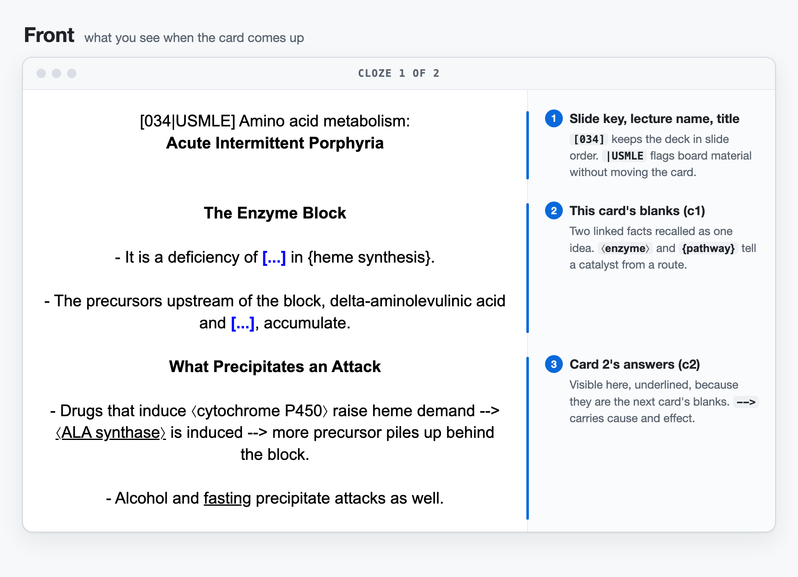
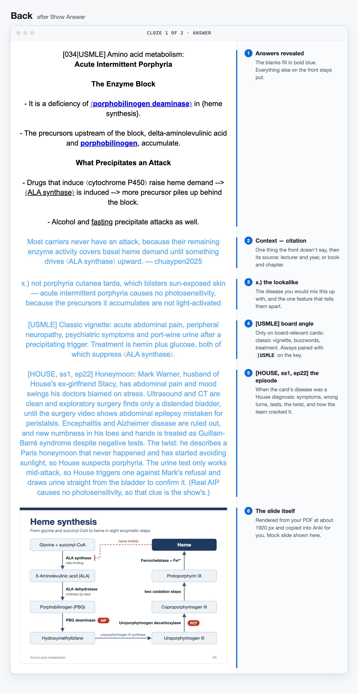

**Ultimate anki flashcard AI prompt for med school with images**

//infact any professions can use it, this is not limited to Medical School

*Can Auto-add image to the back of the card*
(images will be high-resolution screenshot of every corresponding slide page in attached file)

! this feature only work if your generative AI has access to local files. 
ex. using Claude desktop / Antigravity / Claude code (VS code) / Codex (VS code)


**What will it look like?**

One slide in, one finished card out. Below is example card `[034|USMLE]` from [PROMPT.md](PROMPT.md), drawn the way stock Anki shows it, with every part labelled.





*The slide in this picture is a mock drawn for the README. With a real lecture, the prompt renders your own slides from the PDF.*

Two optional extras appear only on cards that earn them:

- **`[USMLE]`** (and `|USMLE` in the key): for board material, meaning the kind of thing First Aid covers. It adds a short board angle: classic vignette, buzzwords, treatment. To collect every one of them, type `USMLE` in the Anki browser search, or build a filtered deck from that search.
- **`[HOUSE, ss1, ep22]`**: when the card's disease was a diagnosis on House M.D., the back retells that episode: the symptoms, the wrong turns and tests, the twist, and how the team cracked it. Episodes are checked against the House wiki's [list of medical diagnoses](https://house.fandom.com/wiki/List_of_medical_diagnoses).

The `|USMLE` label never changes the slide order:

```
[033] Amino acid metabolism: ...
[034-033] Amino acid metabolism: ...                 <- covers slides 33 and 34
[034|USMLE] Amino acid metabolism: Acute Intermittent Porphyria
[035] Amino acid metabolism: ...
```

With a comma, `[034, USMLE]` would sort before `[034-033]`. That's why the label uses `|`.

**How to use?** [No-image]

1. Copy this into ANY generative AI ex. Gemini, ChatGPT, Cluade. You will get plain text and .txt file

**--> PROMPT.md :** https://github.com/Punnawit9285/Anki-Prompt-for-Med-School/blob/main/PROMPT.md

! for Claude) recommend using this with Claude code in Vscode (so that it doesn't have token limitation issue)

3. Open Anki --> click "import file" button (at the button of deck page)
**- Card type : Cloze (very important!!)**

!! be careful) select the correct deck

3. Done! (edit as you wish)
**The intention of this flashcard is to be used as pre-lecture template. Furthur information/notes should be reviewed by human.

**Features**

- **Structured Layout & Metadata**
  - Enforces bold tags (`<b>Heading</b>`) for titles and subtopic headers, separated by double line breaks (`<br><br>`).
  - Wraps the `Extra` back-field in `<font color='#55aaff'>`, separating notes from citations with em-dashes (` — `).
  - Assigns single, lowercase tags matching component domains and topic acronyms (e.g., `bsxtranscription`).
    
- **Deterministic Deck Sorting**
  - Prefixes cards with zero-padded slide keys (e.g., `[003]`) to ensure correct sorting in the Anki browser.
  - Maps slide ranges using reversed high-to-low keys (e.g., `[013-012]`) to place summaries immediately after covered content.
  - Appends sequential lowercase letters (`[099a]`, `[099b]`) for multi-card slides to preserve reading order.

- **Information Design & Selective Clozing**
  - Applies the minimum information principle, targeting 2–3 clozes per group (`{{c1::...}}`).
  - Mandates inline underline tags inside cloze boundaries (`{{c1::<u>answer text</u>}}`).
  - Keeps numerical metrics, doses, and measurements as unclozed plain text context.
  - Tracks repeated cloze targets within a subtopic using an external `[sa]` marker (`{{c1::<u>Target</u>}}[sa]`).

- **MathJax & Chemical Formatting**
  - Renders formulas and equations via inline MathJax `\(\mathrm{...}\)`, banning display brackets `\[ \]`.
  - Prevents Anki double-brace parse collisions by placing charge superscripts outside `\mathrm{}` (e.g., `\(\mathrm{HPO_4}^{2-}\)`).
  - Standardizes causal arrows using `-->` in prose and `\rightarrow` in MathJax.

- **CSV Architecture & Data Safety**
  - Standardizes field structure as `"Text";"Extra";"Tags"` with semicolon delimiters.
  - Uses single quotes for inline HTML attributes (e.g., `color='#55aaff'`) to prevent CSV string literal corruption.
  - Forbids internal semicolons and unescaped double quotes inside data fields.
  - Strips automatic LLM bracket citations to maintain clean card text.

- **Slide Images on the Back**
  - Renders every slide of the PDF at about 1920 px and puts it at the end of the card's back.
  - Copies the images into Anki's media folder, and can push the notes straight in through AnkiConnect.

- **Memory Aids Only Where They Help**
  - `m.)` mnemonic line for arbitrary lists only, spelled out in full, and marked `(coined)` when the AI made it up.
  - `x.)` lookalike line: the thing you'd confuse it with, and the one feature that tells them apart.

- **USMLE Layer**
  - `|USMLE` in the slide key plus a `[USMLE]` paragraph on the back giving the board angle: classic vignette, buzzwords, first-line treatment.
  - Only on cards that are genuinely board material. It never claims a question was on the exam and gives no drug doses.

- **House M.D. Layer**
  - A `[HOUSE, ss1, ep22]` paragraph retelling the episode whose diagnosis matches the card: presentation, differential and tests, the twist, and how House got there.
  - Episodes are checked against the House wiki's diagnosis list, and the card flags it when the show's medicine is wrong.

- **Automated Validation**
  - Requires a pre-emission check to verify column delimiter counts, MathJax syntax, cloze indexing, and slide ordering before code output.

**Real screenshots from Anki** (from an earlier version of the prompt)

<details>
<summary>Front and back</summary>

Front :


Back : 

</details>

**Sorting in the Anki browser**

- Alphabetically/numberically order when click on "sort field" column head :
Use 3 digits and greater number come first eg. [013-012] in order to make it sort properly

Why? : The reason lies with how SQLite works

**The most common reason SQLite sorts numbers weirdly (like showing 1, 10, 11, 2, 21, 3 instead of 1, 2, 3, 10) is that the column is storing data as TEXT instead of an INTEGER or REAL.When numbers are stored as text, SQLite sorts them alphabetically (character by character) rather than numerically.

**Fix : Add Leading Zeros: Pad your numbers with zeros so every number has the same digit length (e.g., use 01, 02... 09, 10 instead of 1, 2... 9, 10). (As done in prompt)

- If user wants to add cards/page, I suggest putting [page number] as the first thing so that when sorted it's directly next to existing card with that specific page/pages


