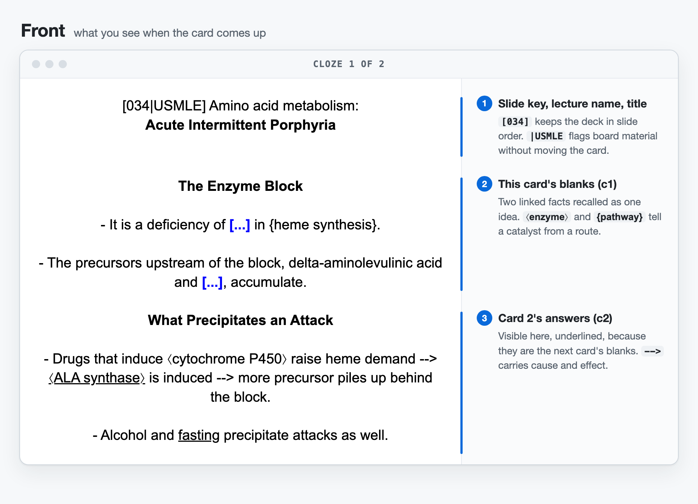
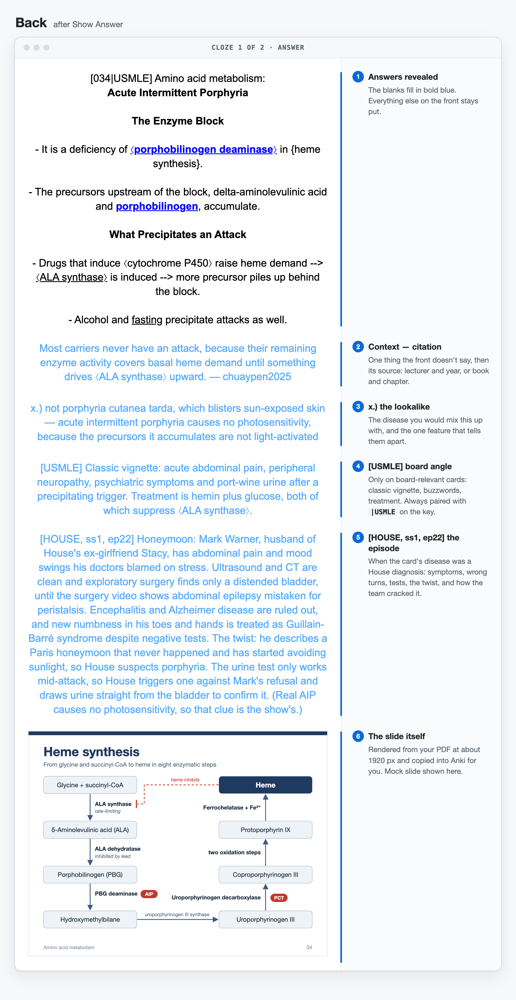

# Anki AI Prompt for Med School

**An AI-assisted Anki workflow built with medical students in mind.** Give an AI your lecture PDF and this prompt. You get back structured, high-yield cloze flashcards in slide order, ready for Anki. If the AI can reach files on your computer, each card also shows its original slide on the back.

- **No coding and no VS Code.** The prompt works in any AI chat: ChatGPT, Claude or Gemini, in the browser or on your phone.
- **Slide images, and no importing,** with an AI desktop app that can access your files, such as the Claude or ChatGPT desktop app.
- **No broken images.** If the AI can't reach your files, it leaves the images out cleanly, so you never get cards with a broken-image icon.

Built for medical school, but it works for any subject taught from slides.

**→ Get the prompt: [PROMPT.md](PROMPT.md)**

## What a card looks like

One slide in, one finished card out. Below is example card `[034|USMLE]` from [PROMPT.md](PROMPT.md), drawn the way stock Anki shows it, with every part labelled.





*The slide in this picture is a mock drawn for the README. With a real lecture, the prompt renders your own slides from the PDF. A text-only card looks the same, minus the slide at the bottom.*

## Pick your path

| | **A. Any AI chat** | **B. AI desktop app with access to your files** |
|---|---|---|
| Where | ChatGPT, Claude or Gemini, in the browser or the phone app | For example the Claude or ChatGPT desktop app |
| Setup | None | Install the free AnkiConnect add-on, once |
| Flashcards | ✅ | ✅ |
| Slide image on the back of each card | ❌ Left out on purpose | ✅ |
| Cards go into Anki by themselves | ❌ You import one .txt file | ✅ Through AnkiConnect |

Not sure which one you're using? Paste the prompt anyway. The AI first checks what it can reach, and its reply tells you whether the deck has images or is text-only.

## Path A: any AI chat (nothing to install)

1. **Copy the prompt.** Open [PROMPT.md](PROMPT.md) and click **Copy raw file**, the copy icon at the top right of the file.
2. **Send it with your lecture.** Open ChatGPT, Claude or Gemini. Paste the prompt, attach your lecture PDF, and send.
   - If the chat says the message is too long, download PROMPT.md and attach it next to the PDF. Then type: *Follow the instructions in PROMPT.md for the attached lecture.*
3. **Save the cards as a .txt file.** The reply ends with one long code block. Click its copy button, paste it into a plain-text file, and save it, e.g. as `lecture.txt`.
   - Windows: use Notepad. Mac: use TextEdit, and choose Format → Make Plain Text before you save.
   - Or ask the AI: *Give me that as a downloadable .txt file.*
4. **Import it into Anki** on your computer. Click **File → Import** (or **Import File** at the bottom of the deck list) and pick your .txt. Then check:
   - **Note type: Cloze.** This is the setting that matters most.
   - **Deck:** the deck you want the cards in.
   - **Field separator:** Semicolon.
   - **Allow HTML in fields:** on.
   - **Field mapping:** column 1 → Text, 2 → Back Extra, 3 → Tags. Anki usually fills this in for you.

   

5. **Done.** Edit the cards as you like. They're a pre-lecture template: review them before class, and add your own notes during it.

Cards made this way are text-only. They're complete, just without the slide picture. For the pictures, use Path B.

## Path B: AI desktop app with access to your files

An AI app that can read and write files on your own computer can do the whole job. It turns every slide into an image, puts the images where Anki looks for them, and, with AnkiConnect, adds the cards to Anki itself. You never open an import screen.

**Which apps?** Any AI app that can access files on your computer, such as the Claude desktop app or the ChatGPT desktop app. Developer tools like Claude Code, Codex and Antigravity work too. You don't need VS Code.

The app has to run on the computer where Anki is installed. Browser chats and cloud "code interpreter" tools can't reach your computer, so they give you text-only cards, as in Path A.

**One-time setup**

1. Install [Anki](https://apps.ankiweb.net) on your computer and open it once.
2. Install AnkiConnect. In Anki, go to **Tools → Add-ons → Get Add-ons…**, paste the code `2055492159`, click OK, and restart Anki. Leave its settings at their defaults.

**For every lecture**

1. Open Anki and leave it open.
2. Put the lecture PDF in your Downloads folder or on your Desktop.
3. In the AI app, paste the prompt, attach the PDF, and send. Allow file access when the app asks.
4. When it asks which deck to use, tell it.
5. Open **Browse** in Anki. The cards are there, each with its slide on the back. You also get the `.txt` file as a backup.

The AI only ever adds files. It never deletes or overwrites anything in Anki's media folder. If an image name is already taken, it stops and asks you.

No AnkiConnect? You still get the images. The AI puts them in place and gives you the `.txt`, and you import it as in Path A, step 4.

## When the AI can't reach your files: clean text-only cards

Before it writes a single card, the prompt checks whether the AI can reach your lecture file and Anki's media folder. If it can't, it switches to **text-only mode**:

- The cards are complete. Only the slide picture on the back is left out.
- No image tag is written at all, so no card can show a broken-image icon.
- The reply tells you it made text-only cards, and why.

Path B falls back the same way if something breaks halfway, for example if the AI can't find Anki's media folder. It removes every image it couldn't put in place before it hands you anything. You never get cards that point at missing pictures.

## If something goes wrong

- **Everything lands in one field, or you see raw code like `<b>`:** import again with Note type **Cloze**, Field separator **Semicolon** and **Allow HTML in fields** on.
- **The reply stops partway through a long lecture:** ask for the cards in parts, e.g. slides 1–30, then 31–60, and paste the parts one after another into the same `.txt`. Each card carries its slide number, so Anki puts them back in order. With Claude, running the prompt in Claude Code avoids most length limits.
- **A card shows a broken-image icon** (only possible with decks made by older versions of the prompt): its picture never reached Anki's media folder. Copy the slide images into that folder, then run **Tools → Check Media**.
- **Slide pictures on your phone:** they arrive when you sync with AnkiWeb, like any other Anki media.

## Optional extras: [USMLE] and [HOUSE]

Two optional extras appear only on cards that earn them:

- **`[USMLE]`** (and `|USMLE` in the key): for board material, meaning the kind of thing First Aid covers. It adds a short board angle: classic vignette, buzzwords, treatment. To collect every one of them, type `USMLE` in the Anki browser search, or build a filtered deck from that search.
- **`[HOUSE, ss1, ep22]`**: when the card's disease was a diagnosis on House M.D., the back retells that episode: the symptoms, the wrong turns and tests, the twist, and how the team cracked it. Episodes are checked against the House wiki's [list of medical diagnoses](https://house.fandom.com/wiki/List_of_medical_diagnoses).

The `|USMLE` label never changes the slide order:

```
[033] Amino acid metabolism: ...
[034-033] Amino acid metabolism: ...                 <- covers slides 33 and 34
[034|USMLE] Amino acid metabolism: Acute Intermittent Porphyria
[035] Amino acid metabolism: ...
```

With a comma, `[034, USMLE]` would sort before `[034-033]`. That's why the label uses `|`.

## Features

- **Structured Layout & Metadata**
  - Enforces bold tags (`<b>Heading</b>`) for titles and subtopic headers, separated by double line breaks (`<br><br>`).
  - Wraps the `Extra` back-field in `<font color='#55aaff'>`, separating notes from citations with em-dashes (` — `).
  - Assigns single, lowercase tags matching component domains and topic acronyms (e.g., `bsxtranscription`).

- **Deterministic Deck Sorting**
  - Prefixes cards with zero-padded slide keys (e.g., `[003]`) to ensure correct sorting in the Anki browser.
  - Maps slide ranges using reversed high-to-low keys (e.g., `[013-012]`) to place summaries immediately after covered content.
  - Appends sequential lowercase letters (`[099a]`, `[099b]`) for multi-card slides to preserve reading order.

- **Information Design & Selective Clozing**
  - Applies the minimum information principle, targeting 2–3 clozes per group (`{{c1::...}}`).
  - Mandates inline underline tags inside cloze boundaries (`{{c1::<u>answer text</u>}}`).
  - Keeps numerical metrics, doses, and measurements as unclozed plain text context.
  - Tracks repeated cloze targets within a subtopic using an external `[sa]` marker (`{{c1::<u>Target</u>}}[sa]`).

- **MathJax & Chemical Formatting**
  - Renders formulas and equations via inline MathJax `\(\mathrm{...}\)`, banning display brackets `\[ \]`.
  - Prevents Anki double-brace parse collisions by placing charge superscripts outside `\mathrm{}` (e.g., `\(\mathrm{HPO_4}^{2-}\)`).
  - Standardizes causal arrows using `-->` in prose and `\rightarrow` in MathJax.

- **CSV Architecture & Data Safety**
  - Standardizes field structure as `"Text";"Extra";"Tags"` with semicolon delimiters.
  - Uses single quotes for inline HTML attributes (e.g., `color='#55aaff'`) to prevent CSV string literal corruption.
  - Forbids internal semicolons and unescaped double quotes inside data fields.
  - Strips automatic LLM bracket citations to maintain clean card text.

- **Slide Images on the Back**
  - Renders every slide of the PDF at about 1920 px and puts it at the end of the card's back.
  - Copies the images into Anki's media folder, and can push the notes straight in through AnkiConnect.
  - Falls back to clean text-only cards when the AI can't reach your computer, so no card ever carries a broken image.

- **English Cards From Any Language**
  - Slides in Thai or any other language still come out as English cards, with each technical term kept the way the slide prints it.

- **Memory Aids Only Where They Help**
  - `m.)` mnemonic line for arbitrary lists only, spelled out in full, and marked `(coined)` when the AI made it up.
  - `x.)` lookalike line: the thing you'd confuse it with, and the one feature that tells them apart.

- **USMLE Layer**
  - `|USMLE` in the slide key plus a `[USMLE]` paragraph on the back giving the board angle: classic vignette, buzzwords, first-line treatment.
  - Only on cards that are genuinely board material. It never claims a question was on the exam and gives no drug doses.

- **House M.D. Layer**
  - A `[HOUSE, ss1, ep22]` paragraph retelling the episode whose diagnosis matches the card: presentation, differential and tests, the twist, and how House got there.
  - Episodes are checked against the House wiki's diagnosis list, and the card flags it when the show's medicine is wrong.

- **Automated Validation**
  - Requires a pre-emission check to verify column delimiter counts, MathJax syntax, cloze indexing, and slide ordering before code output.

## Real screenshots from Anki

These come from an earlier version of the prompt.

<details>
<summary>Front and back</summary>

Front :


Back : 

</details>

## Sorting in the Anki browser

Click the **Sort Field** column header in the Anki browser, and the cards line up in slide order.

- **Why three digits?** Anki sorts that column as text, one character at a time, the way SQLite sorts numbers stored as text. So `10` would sort before `2`. Padding every number to three digits, `002` and `010`, fixes that.
- **Why the higher number first?** A card covering slides 12 and 13 is keyed `[013-012]`, so it sorts after slide 12 and before slide 13, right next to the slides it covers.
- **Adding your own card later?** Start it with the slide number in the same form, e.g. `[042]`, and it sorts next to the other cards from that slide.


